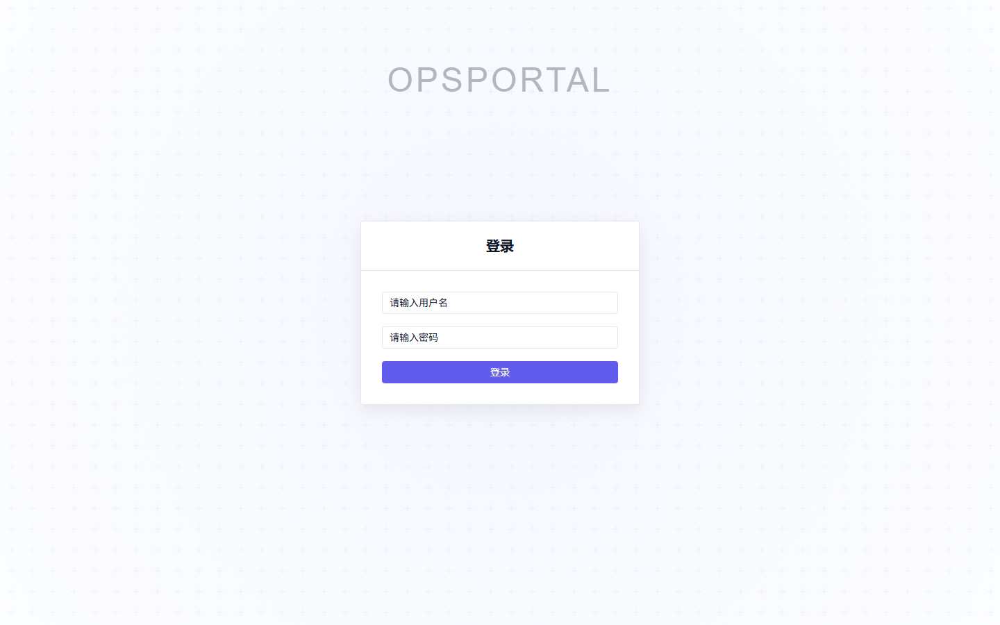
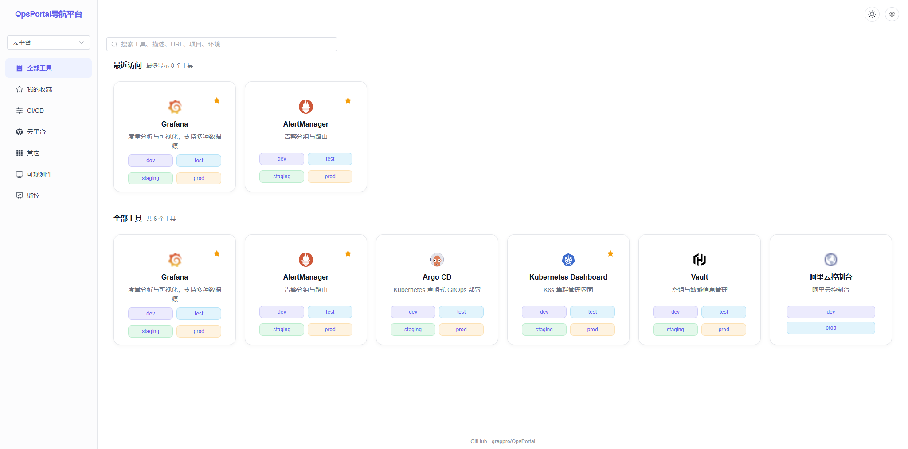
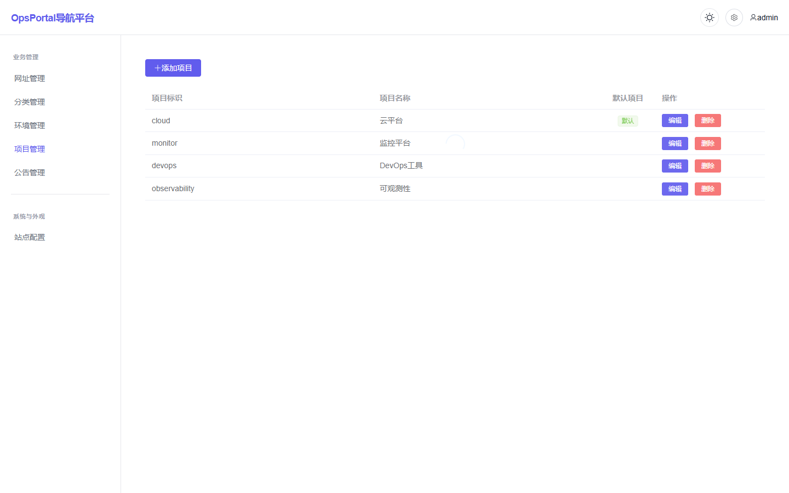

# OpsPortal 运维导航平台

OpsPortal 是一个面向运维、DevOps 和平台团队的内部工具导航平台。它把云控制台、监控告警、CI/CD、可观测性、制品仓库等常用入口集中管理，并通过项目、分类、环境和搜索能力，让团队成员更快找到正确入口。

## 界面预览

### 登录页



### 导航首页



### 项目管理



## 主要功能

- 工具导航：以卡片形式展示工具，支持一个工具配置多个环境入口。
- 最近访问：点击任意环境入口后，按工具卡片记录最近访问，本地浏览器自动保留。
- 快捷搜索：支持按工具名称、描述、URL、项目、分类、环境标识和环境名称搜索。
- 项目管理：支持多项目维护，并可设置默认项目。
- 环境管理：支持为不同项目维护 dev、test、staging、prod 等环境。
- 分类管理：支持工具分类及分类图标维护。
- 收藏工具：常用工具可收藏到“我的收藏”。
- 公告管理：首页顶部展示当前激活公告。
- 站点配置：支持配置系统名称和 Logo，系统名称会同步到侧边栏和浏览器标题。
- 主题切换：支持浅色/深色主题。
- 登录认证：后台管理接口基于 JWT 鉴权。
- 健康检查：后端提供 `/api/health` 用于部署探活。

## 技术栈

### 前端

- Vue 3
- Vite
- Vue Router
- Element Plus
- Axios

### 后端

- Go
- Gin
- GORM
- SQLite
- Swagger

## 快速开始

### 本地开发

启动后端：

```bash
cd backend
go mod download
go run main.go
```

启动前端：

```bash
cd frontend
npm install
npm run dev
```

本地访问：

- 前端页面：http://localhost:3000
- 后端 API：http://localhost:8080
- Swagger 文档：http://localhost:8080/swagger/index.html

### Docker Compose

```bash
docker-compose up -d
docker-compose ps
docker-compose logs -f
docker-compose down
```

默认前端容器映射到：

- http://localhost

生产环境可基于 `docker-compose.prod.yml` 调整后端地址、域名和环境变量。

## 默认账号

```text
用户名：admin
密码：admin123
```

首次部署后建议尽快修改默认密码，并在生产环境中替换 JWT 密钥、配置 HTTPS 和数据备份策略。

## 目录结构

```text
OpsPortal/
├── backend/                # Go 后端服务
│   ├── config/             # 数据库等配置
│   ├── docs/               # Swagger 生成文件
│   ├── handlers/           # API 处理器
│   ├── middleware/         # JWT 鉴权中间件
│   ├── models/             # GORM 数据模型
│   ├── uploads/            # 上传文件目录
│   ├── utils/              # 工具函数
│   ├── API.md
│   ├── Dockerfile
│   └── main.go
├── frontend/               # Vue 前端应用
│   ├── src/
│   │   ├── components/     # 通用组件
│   │   ├── composables/    # 组合式函数
│   │   ├── layout/         # 页面布局
│   │   ├── router/         # 路由
│   │   ├── utils/          # 请求封装
│   │   └── views/          # 页面
│   ├── Dockerfile
│   ├── nginx.conf
│   └── vite.config.js
├── docs/                   # README 截图
├── docker-compose.yml
├── docker-compose.prod.yml
└── README.md
```

## API 简表

完整接口以 Swagger 为准：启动后端后访问 `http://localhost:8080/swagger/index.html`。

### 公开接口

- `POST /api/auth/login`：登录
- `GET /api/health`：健康检查
- `GET /api/sites`：获取工具列表
- `GET /api/projects`：获取项目列表
- `GET /api/environments`：获取环境列表
- `GET /api/categories`：获取分类列表
- `GET /api/notices/active`：获取当前激活公告
- `GET /api/logo`：获取当前 Logo
- `GET /api/site-config`：获取站点配置

### 管理接口

以下接口需要携带 JWT：

```text
Authorization: Bearer <token>
```

- `POST /api/sites`：创建工具
- `PUT /api/sites/:id`：更新工具
- `DELETE /api/sites/:id`：删除工具
- `POST /api/projects`：创建项目
- `PUT /api/projects/:id`：更新项目
- `DELETE /api/projects/:id`：删除项目
- `POST /api/environments`：创建环境
- `PUT /api/environments/:id`：更新环境
- `DELETE /api/environments/:id`：删除环境
- `POST /api/categories`：创建分类
- `PUT /api/categories/:id`：更新分类
- `DELETE /api/categories/:id`：删除分类
- `POST /api/notices`：创建公告
- `PUT /api/notices/:id`：更新公告
- `DELETE /api/notices/:id`：删除公告
- `POST /api/upload/logo`：上传 Logo
- `DELETE /api/logo`：删除 Logo
- `PUT /api/site-config`：更新站点配置

## 数据与配置

- 默认数据库：`backend/data/opsportal.db`
- 上传目录：`backend/uploads/`
- 前端开发代理：`frontend/vite.config.js` 中将 `/api`、`/uploads`、`/swagger` 代理到 `http://localhost:8080`
- 最近访问和收藏：存储在浏览器 `localStorage`，不做账号级同步

## 开发计划

- [x] JWT 登录认证
- [x] 工具分类管理
- [x] 收藏工具
- [x] 最近访问
- [x] 快捷搜索
- [x] 站点名称和 Logo 配置
- [ ] 用户管理与角色权限
- [ ] 操作日志
- [ ] 数据导入导出
- [ ] URL 可用性检测
- [ ] 更完整的生产环境配置示例

## 贡献指南

1. Fork 本仓库
2. 创建特性分支：`git checkout -b feature/your-feature`
3. 提交更改：`git commit -m "feat: add your feature"`
4. 推送分支：`git push origin feature/your-feature`
5. 提交 Pull Request

## 许可证

MIT License
