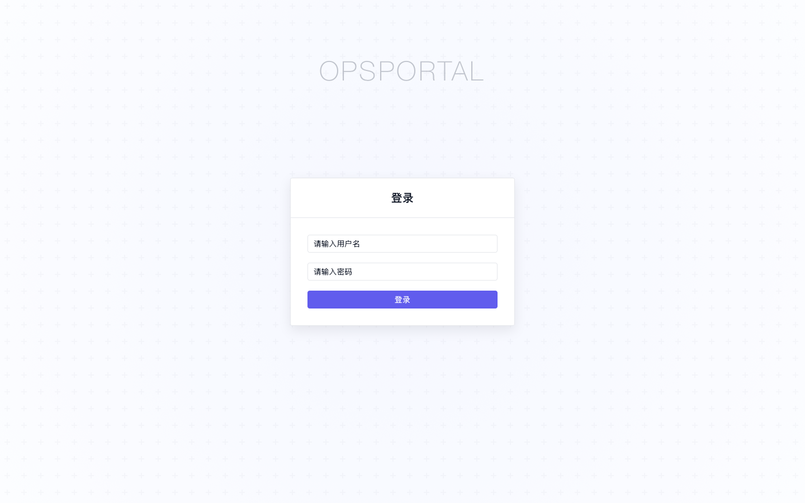
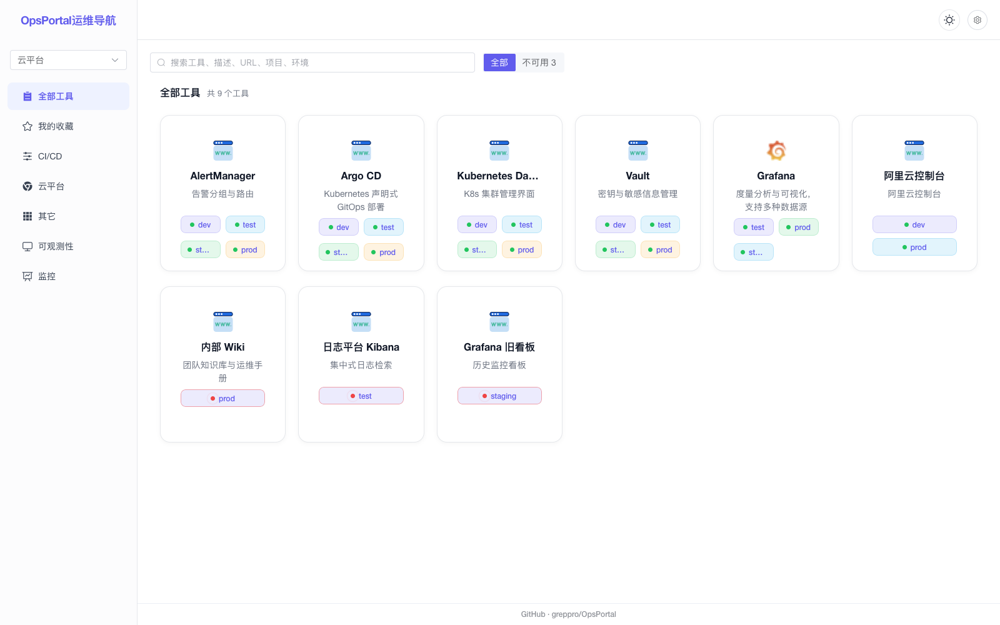
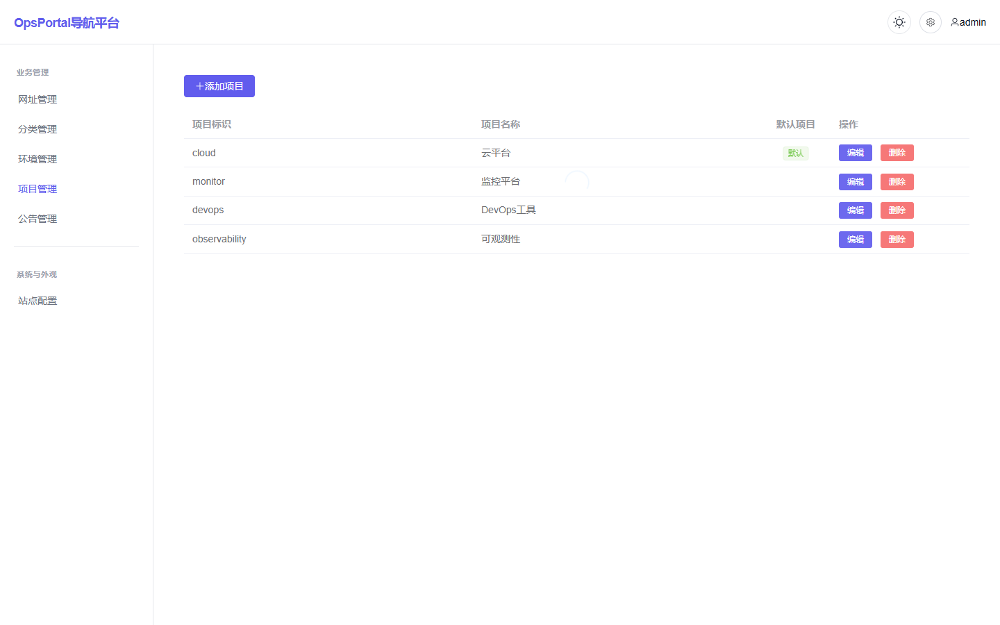

# OpsPortal 运维导航平台

OpsPortal 是一个面向运维、DevOps 和平台团队的内部工具导航平台。它把云控制台、监控告警、CI/CD、可观测性、制品仓库等常用入口集中管理，并通过项目、分类、环境和搜索能力，让团队成员更快找到正确入口。

## 界面预览

### 登录页



### 导航首页



### 项目管理



## 主要功能

- 工具导航：以卡片形式展示工具，支持一个工具配置多个环境入口。
- 最近访问：点击任意环境入口后，按工具卡片记录最近访问，本地浏览器自动保留。
- 快捷搜索：支持按工具名称、描述、URL、项目、分类、环境标识和环境名称搜索。
- 项目管理：支持多项目维护，并可设置默认项目。
- 环境管理：支持为不同项目维护 dev、test、staging、prod 等环境。
- 分类管理：支持工具分类及分类图标维护。
- 收藏工具：常用工具可收藏到“我的收藏”。
- 公告管理：首页顶部展示当前激活公告。
- 站点配置：支持配置系统名称和 Logo，系统名称会同步到侧边栏和浏览器标题。
- 主题切换：支持浅色/深色主题。
- 登录认证：后台管理接口基于 JWT 鉴权，密码使用 bcrypt 加密存储，可在后台修改密码。
- 可用性检测：后台定时检测每个入口地址，首页环境按钮上显示状态点，可以只看不可用的工具。
- Prometheus 对接：`/metrics` 暴露检测结果，`/prometheus/targets` 提供 http_sd 服务发现，可直接接入 blackbox_exporter。
- 健康检查：后端提供 `/api/health` 用于部署探活。

## 技术栈

### 前端

- Vue 3
- Vite
- Vue Router
- Element Plus
- Axios

### 后端

- Go
- Gin
- GORM
- SQLite
- Swagger

## 快速开始

### 本地开发

需要 Go 1.21 或更高版本、Node.js 18 或更高版本。SQLite 驱动依赖 CGO，本机还需要 C 编译器（macOS 安装 Xcode Command Line Tools 即可）。

启动后端：

```bash
cd backend
go mod download
ADMIN_PASSWORD='<初始密码>' go run .
```

`ADMIN_PASSWORD` 只在首次启动、创建管理员账号时生效；不设置时随机生成初始密码，打印在启动日志里。

启动前端：

```bash
cd frontend
npm install
npm run dev
```

本地访问：

- 前端页面：http://localhost:3000
- 后端 API：http://localhost:8080
- Swagger 文档：http://localhost:3000/swagger/index.html（由前端开发服务器转发到后端）

运行测试：

```bash
# 后端单元测试和接口测试
(cd backend && go test ./...)
# 前端构建检查
(cd frontend && npm run build)
```

### Docker Compose

```bash
cp .env.example .env   # 按需填写 ADMIN_PASSWORD、JWT_SECRET 等
docker compose up -d --build
docker compose ps
docker compose logs -f backend
docker compose down
```

启动后访问 http://localhost 。前端容器监听 80 端口，由 nginx 把 `/api`、`/uploads`、`/metrics`、`/prometheus/` 转发给后端，后端端口不对外暴露。

数据库和上传的 Logo 分别保存在宿主机的 `./data` 和 `./uploads`，重建容器不会丢失。

对外提供服务时：

- `/metrics` 和 `/prometheus/targets` 默认不需要登录，内容包含所有入口地址，能从公网访问时请设置 `METRICS_TOKEN`；
- HTTPS 由前面的反向代理或负载均衡提供。

## 管理员账号

管理员用户名为 `admin`。

- 首次启动时，如果设置了 `ADMIN_PASSWORD`，就用它作为初始密码。
- 没有设置时，后端会随机生成一个初始密码，打印在启动日志里（只显示一次）：

  ```bash
  docker compose logs backend | grep 初始密码
  ```

- 登录后可在后台右上角的用户菜单里修改密码。修改后，之前签发的所有登录 token 立即失效。

## 配置项

后端通过环境变量配置。用 docker compose 部署时，把变量写在同目录的 `.env` 里（参考 `.env.example`），由 `docker-compose.yml` 传给后端容器；`HOST`、`PORT`、`DB_PATH` 在容器里保持默认即可。

| 变量 | 默认值 | 说明 |
|------|--------|------|
| `HOST` | 空（所有网卡） | 监听地址，只允许本机访问时设为 `127.0.0.1` |
| `PORT` | `8080` | 监听端口 |
| `DB_PATH` | `data/opsportal.db` | SQLite 数据库文件路径 |
| `ADMIN_PASSWORD` | 空 | 首次启动时管理员的初始密码，为空则随机生成并打印到日志 |
| `JWT_SECRET` | 空 | JWT 签名密钥，为空则自动生成并保存在数据库里 |
| `CORS_ALLOW_ORIGINS` | 空 | 允许跨域访问的来源，逗号分隔；为空时不开启跨域（前端通过同源反向代理访问即可） |
| `METRICS_TOKEN` | 空 | 设置后访问 `/metrics` 和 `/prometheus/targets` 需要 `Authorization: Bearer <token>` |
| `PROBE_ENABLED` | `true` | 是否开启内置可用性检测 |
| `PROBE_INTERVAL` | `60s` | 检测间隔，最小 `10s` |
| `PROBE_TIMEOUT` | `5s` | 单次请求超时 |
| `PROBE_CONCURRENCY` | `10` | 同时检测的地址数 |
| `PROBE_INSECURE_SKIP_VERIFY` | `false` | 跳过 TLS 证书校验（内网自签证书时使用，作用于所有地址） |

检测请求会读取 `HTTP_PROXY`、`HTTPS_PROXY`、`NO_PROXY`。内网 CA 签发的证书，可以把 CA 证书挂进容器并设置 `SSL_CERT_FILE`，不必关闭证书校验。

## 从旧版本升级

- 后端启动时不再重建环境表，后台修改或新增的环境会一直保留。新建项目不会再自动生成 dev/test/staging/prod，需要在「环境管理」里添加。
- 旧版本数据库里的明文密码会在启动时自动转成 bcrypt 哈希，原密码继续有效。仍在使用默认密码 `admin123` 时，进入后台会提示修改。
- JWT 密钥不再写死在代码里，升级后需要重新登录一次。
- `GET /api/notices`（含未激活的公告）改为需要登录。
- 用 docker compose 部署的，新版本多挂载了 `./uploads`。旧版本的 Logo 存在容器内部，升级前可以先执行 `mkdir -p uploads && docker cp opsportal-backend:/app/uploads/. ./uploads/` 拷出来，否则升级后需要重新上传。

## 可用性检测与 Prometheus

后端每隔 `PROBE_INTERVAL` 对所有开启检测的工具地址发起一次 GET 请求（相同地址只请求一次，跟随最多 5 次重定向），判断规则：

- 状态码小于 400，或者是 401/403（服务在线，只是需要登录），算可用；
- 其他状态码、超时、域名解析失败、连接被拒绝、TLS 证书错误，算不可用。

首页每个环境按钮前会显示状态点（绿色可用、红色不可用，悬停可看状态码、耗时和失败原因），工具栏可以切换到只看不可用的工具。后台「网址管理」里可以看到每个地址的检测结果，也可以点「检测」立即重新检测；不需要检测的地址（比如只能从办公网访问的）可以在编辑时关闭「可用性检测」。

检测结果反映的是 OpsPortal 后端所在网络的视角。

### 方式一：抓取 OpsPortal 的检测结果

`/metrics` 输出以下指标，标签为 `tool_id`、`tool`、`project`、`environment`、`category`、`url`：

| 指标 | 说明 |
|------|------|
| `opsportal_probe_success` | 最近一次检测是否可用（1/0） |
| `opsportal_probe_duration_seconds` | 最近一次检测耗时 |
| `opsportal_probe_http_status_code` | 最近一次检测的 HTTP 状态码，没有收到响应时为 0 |
| `opsportal_probe_timestamp_seconds` | 最近一次检测的时间 |
| `opsportal_probe_last_round_timestamp_seconds` | 最近一轮检测完成的时间 |
| `opsportal_tools` | 工具条目总数 |
| `opsportal_probe_enabled` | 是否开启了内置检测 |

```yaml
scrape_configs:
  - job_name: opsportal
    metrics_path: /metrics
    static_configs:
      - targets: ['opsportal.example.com']   # 前端入口；也可以直接抓后端 backend:8080
    # 设置了 METRICS_TOKEN 时：
    # authorization:
    #   credentials: <METRICS_TOKEN>
```

告警规则示例：

```yaml
groups:
  - name: opsportal
    rules:
      - alert: OpsPortalToolDown
        expr: opsportal_probe_success == 0
        for: 3m
        labels:
          severity: warning
        annotations:
          summary: "{{ $labels.tool }}（{{ $labels.project }}/{{ $labels.environment }}）不可用"
          description: "{{ $labels.url }} 连续 3 分钟检测失败"
```

### 方式二：用 blackbox_exporter 探测（http_sd 服务发现）

`/prometheus/targets` 按 Prometheus `http_sd_configs` 的格式返回所有开启检测的地址，标签为 `tool_id`、`tool`、`project`、`environment`、`category`。可以用查询参数 `project`、`environment`、`category` 筛选，比如只把生产环境交给更短的抓取间隔。门户里新增入口后会自动成为探测目标，不用再手写探测配置。

```yaml
scrape_configs:
  - job_name: opsportal-blackbox
    metrics_path: /probe
    params:
      module: [http_2xx]
    http_sd_configs:
      - url: http://opsportal.example.com/prometheus/targets   # 可加 ?environment=prod
        refresh_interval: 5m
        # authorization:
        #   credentials: <METRICS_TOKEN>
    relabel_configs:
      - source_labels: [__address__]
        target_label: __param_target
      - source_labels: [__param_target]
        target_label: instance
      - target_label: __address__
        replacement: blackbox-exporter:9115
```

blackbox_exporter 的 `http_2xx` 模块默认只把 2xx 算作成功，需要登录的地址可以在模块里配置 `valid_status_codes`。

两种方式可以同时使用；只用 blackbox 探测时，可以设置 `PROBE_ENABLED=false` 关闭内置检测。

## 目录结构

```text
OpsPortal/
├── backend/                  # Go 后端服务
│   ├── config/               # 环境变量配置、数据库初始化与升级迁移
│   ├── docs/                 # Swagger 生成文件
│   ├── handlers/             # API 处理器
│   ├── middleware/           # JWT 鉴权中间件
│   ├── models/               # GORM 数据模型
│   ├── probe/                # 可用性检测与 Prometheus 指标
│   ├── utils/                # JWT、密码哈希
│   ├── main.go
│   ├── main_test.go          # 接口测试
│   ├── API.md                # 接口说明
│   ├── tests.md              # curl 测试用例
│   ├── Dockerfile
│   └── docker-entrypoint.sh  # 容器入口：修正挂载目录属主后降权运行
├── frontend/                 # Vue 前端应用
│   ├── src/
│   │   ├── api/              # 接口封装
│   │   ├── components/       # 通用组件
│   │   ├── composables/      # 组合式函数（收藏、主题、可用性状态）
│   │   ├── layout/           # 页面布局
│   │   ├── router/           # 路由
│   │   ├── utils/            # 请求封装、登录状态
│   │   └── views/            # 页面
│   ├── Dockerfile
│   ├── nginx.conf            # 前端镜像的 nginx 配置，转发后端路径
│   └── vite.config.js
├── docs/                     # README 截图
├── .env.example              # docker compose 环境变量示例
├── docker-compose.yml
├── docker-compose.prod.yml
└── README.md
```

## API 简表

完整接口以 Swagger 为准（本地开发时访问 http://localhost:3000/swagger/index.html），请求和响应示例见 `backend/API.md`。

### 公开接口

- `POST /api/auth/login`：登录
- `GET /api/health`：健康检查
- `GET /api/sites`：获取工具列表
- `GET /api/projects`：获取项目列表
- `GET /api/environments`：获取环境列表
- `GET /api/categories`：获取分类列表
- `GET /api/notices/active`：获取当前激活公告
- `GET /api/logo`：获取当前 Logo
- `GET /api/site-config`：获取站点配置
- `GET /api/probe/status`：获取各工具最近一次的可用性检测结果

### 管理接口

以下接口需要携带 JWT：

```text
Authorization: Bearer <token>
```

- `POST /api/auth/change-password`：修改密码（响应里返回新 token，旧 token 失效）
- `POST /api/sites`：创建工具
- `PUT /api/sites/:id`：更新工具
- `DELETE /api/sites/:id`：删除工具
- `POST /api/probe/check/:id`：立即检测某个工具
- `POST /api/projects`：创建项目
- `PUT /api/projects/:id`：更新项目
- `DELETE /api/projects/:id`：删除项目
- `POST /api/environments`：创建环境
- `PUT /api/environments/:id`：更新环境
- `DELETE /api/environments/:id`：删除环境
- `POST /api/categories`：创建分类
- `PUT /api/categories/:id`：更新分类
- `DELETE /api/categories/:id`：删除分类
- `GET /api/notices`：获取公告列表（含未激活的公告）
- `POST /api/notices`：创建公告
- `PUT /api/notices/:id`：更新公告
- `DELETE /api/notices/:id`：删除公告
- `POST /api/upload/logo`：上传 Logo
- `DELETE /api/logo`：删除 Logo
- `PUT /api/site-config`：更新站点配置

### Prometheus 接口

设置了 `METRICS_TOKEN` 时需要 `Authorization: Bearer <METRICS_TOKEN>`。

- `GET /metrics`：Prometheus 格式的检测指标
- `GET /prometheus/targets`：http_sd 服务发现，支持 `project`、`environment`、`category` 查询参数

## 数据与配置

- 默认数据库：`backend/data/opsportal.db`（启动时自动创建，可用 `DB_PATH` 修改）
- 上传目录：`backend/uploads/`（启动时自动创建，docker compose 部署时挂载为宿主机的 `./uploads`）
- 前端开发代理：`frontend/vite.config.js` 中将 `/api`、`/uploads`、`/swagger` 代理到 `http://localhost:8080`
- 前端镜像转发：`frontend/nginx.conf` 中将 `/api`、`/uploads`、`/swagger`、`/metrics`、`/prometheus/` 转发到后端容器 `backend:8080`
- 最近访问和收藏：存储在浏览器 `localStorage`，不做账号级同步

## 开发计划

- [x] JWT 登录认证
- [x] 工具分类管理
- [x] 收藏工具
- [x] 最近访问
- [x] 快捷搜索
- [x] 站点名称和 Logo 配置
- [x] URL 可用性检测（内置检测 + Prometheus 指标与服务发现）
- [ ] 用户管理与角色权限
- [ ] 操作日志
- [ ] 数据导入导出
- [ ] 更完整的生产环境配置示例

## 贡献指南

1. Fork 本仓库
2. 创建特性分支：`git checkout -b feature/your-feature`
3. 提交前确认测试通过：后端 `go test ./...`，前端 `npm run build`
4. 提交更改：`git commit -m "feat: add your feature"`
5. 推送分支：`git push origin feature/your-feature`
6. 提交 Pull Request

## 许可证

MIT License
